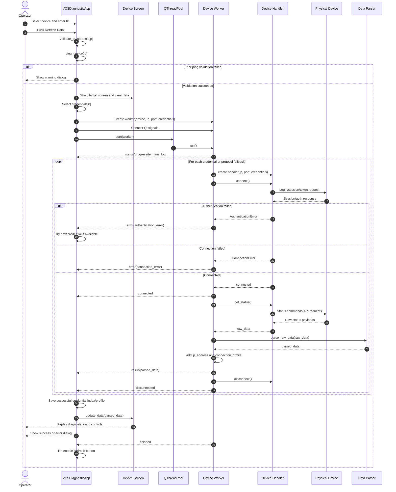

> **Status:** Historical migration input and reference snapshot. This document
> preserves the reverse-engineered baseline tracked in commit
> `1b5183b3b1eb57a7529b36f445629e0fa53e9971`; all following content is restored
> from that revision without semantic changes.
>
> This document is a historical migration reference. It is not the authoritative
> source for current requirements. Current behavior is governed by the
> specifications under `openspec/specs/`.
>
> Where this snapshot and an active/root OpenSpec specification differ, the
> current specification takes precedence. Later changes may supersede this
> snapshot; it must not be used instead of active/root specifications.

# OpenSpec: Diagnostic Module for VCS and AV Devices

## 1. Metadata

| Field | Value |
| --- | --- |
| Program | VCS Diagnostic Module |
| Entry point | `main.py` |
| Primary UI | `gui/main_window.py::VCSDiagnosticApp` |
| Specification type | Reverse-engineered behavioral specification |
| Scope | Existing behavior only; no refactoring proposals |

## 2. Module Purpose

The program is a PyQt5 desktop diagnostic and control application for several room devices. It lets an operator select a device model, enter an IP address, connect to the device with a predefined or user-added credential set, display a fixed set of diagnostic parameters, and perform device-specific actions.

Supported device groups:

| Device | Screen | Main role |
| --- | --- | --- |
| Huawei TE-20 | Codec screen | Codec status, presentation, audio/microphone, wake from sleep |
| Huawei TE-40 | Codec screen | Codec status, presentation, volume/microphone, SIP server update |
| Huawei CloudLink Bar 310 | Codec screen | Codec status, presentation, volume/microphone, SIP server update |
| Polycom RPG 310 | Codec screen | Codec status via HTTPS plus additional values via SSH |
| Extron IN1804 | Matrix screen | Matrix input status, HDCP, active routing, routing control |
| Aten PE8208AV | PDU screen | Outlet status and outlet on/off/reboot control |

The application is organized as:

| Layer | Modules | Responsibility |
| --- | --- | --- |
| Entry and crash handling | `main.py` | Starts QApplication and writes unhandled exceptions to `app_crash.log` |
| UI shell | `gui/main_window.py` | Device selection, IP input, credential handling, worker lifecycle, progress/error dialogs |
| UI screens | `gui/screens/*.py` | Display codec, matrix, and PDU data; emit user control actions |
| Workers | `core/worker.py`, `core/te20_worker.py` | Run network operations outside the UI thread and emit Qt signals |
| Handlers | `handlers/**` | Implement device-specific protocols and commands |
| Parsers | `core/parser.py` | Convert raw device responses into GUI-facing dictionaries |
| Shared base types | `core/base_handler.py`, `core/exceptions.py` | Abstract protocol interface and domain exception classes |
| Utilities | `utils/ssl_adapter.py`, `utils/te20_stack.py` | Legacy TLS support and TE20 HTTPS capability checks |

## 3. Inputs

### 3.1 User Inputs

| Input | Source | Type | Validation/behavior |
| --- | --- | --- | --- |
| Device model | Combo box in `VCSDiagnosticApp` | `str` from supported device list | Non-device category headers are disabled in the combo box |
| IP address | `ip_entry` | IPv4 string | Must match `n.n.n.n` and every octet must be `0..255` |
| Refresh action | Refresh button | UI event | Triggers `refresh_data()` |
| Custom credentials | Credentials dialog | `username: str`, `password: str` | Inserted into the selected device credential list, usually at index `0` |
| Codec presentation action | Codec screen buttons | `"Start"` or `"Stop"` | Delegated to current codec handler |
| Codec volume/microphone action | Codec screen buttons | Integer volume or mute state | Range checked by handler where implemented |
| SIP fix action | Codec screen button | Confirmed action | Uses target SIP server `link.ru` |
| Matrix route action | Matrix table click | Input row number | Only output column is actionable; output is fixed to `1` |
| PDU outlet action | PDU table button | Outlet number and command | Command is `on`, `off`, or `reboot` after confirmation |
| Debug terminal action | Debug button/menu | UI event | Opens the relevant terminal log dialog |

### 3.2 Internal Configuration Inputs

Credential lists are defined in `VCSDiagnosticApp.device_credentials` and are tried by index. Successful credential indices are remembered per device and IP through `current_credential_index` and helper methods.

Default ports and protocol preferences:

| Device | Default connection |
| --- | --- |
| Huawei TE-20 | HTTP `80`, optional HTTPS `443` if TE20 HTTPS stack is ready |
| Huawei TE-40 | HTTPS `443`, fallback to HTTP `80` in worker |
| CloudLink Bar 310 | HTTPS `443` |
| Polycom RPG 310 | HTTPS `443` plus SSH `22` for extra status/control |
| Extron IN1804 | SSH `22022` first, then plain TCP/Telnet on configured port `22023` |
| Aten PE8208AV | HTTPS `443` |

## 4. Outputs

### 4.1 UI Outputs

| Output | Destination | Shape |
| --- | --- | --- |
| Codec status | `CodecScreen` | Named parameter rows |
| Matrix status | `MatrixScreen` | Table rows for inputs plus model, temperature, protocol |
| PDU status | `PDUScreen` | Device info panel and outlet control table |
| Progress | `QProgressDialog` | Percentage and status text from worker signals |
| Terminal logs | `MatrixTerminalDialog` | Line-oriented request/response/session text |
| Success/failure messages | `QMessageBox` | User-facing information, warning, or critical dialog |
| Crash report | `app_crash.log` | Timestamped Python traceback |

### 4.2 Worker Signal Contract

All workers expose a `signals` object with these Qt signals:

| Signal | Payload | Meaning |
| --- | --- | --- |
| `finished` | none | Worker reached final block |
| `error` | `(error_type: str, message: str, traceback: str)` | Operation failed |
| `result` | `dict` | Parsed data ready for screen update |
| `progress` | `int` | Progress value from `0` to `100` |
| `status` | `str` | Human-readable current step |
| `terminal_log` | `str` | Low-level command/session log |
| `connected` | none | Device connection established |
| `disconnected` | none | Device disconnected |

### 4.3 Common Codec Output Fields

Codec parsers normalize raw responses into dictionaries containing some or all of:

```yaml
ip_address: str
connection_profile:
  port: int
  use_ssl: bool
  label: str
Модель: str
Версия ПО: str
Серийный номер: str
MAC адрес: str
SIP регистрация: str
SIP адрес: str
SIP номер: str
Время работы: str
Статус звонка: str
Режим презентации: str
Статус микрофона: str
Mute микрофона: str
Громкость динамиков: str | int
Статус камеры: str
WAN IP: str
```

The codec screen maps these parser keys to display rows such as firmware version, codec model, serial number, MAC address, SIP registration, uptime, call status, presentation status, microphone/mute state, speaker volume, camera status, and call log button.

### 4.4 Matrix Output Fields

`ExtronIN1804DataParser.parse()` returns:

```yaml
model: str
temperature: int
inputs_num: int
outputs_num: int
input_names: list[str]
output_names: list[str]
connection_protocol: str
signal_status:
  <input_number>:
    has_signal: bool
    status_text: str
input_hdcp_auth: list[int]
input_hdcp_status: list[str]
output_hdcp: str
current_connection: int
ip_address: str
```

### 4.5 PDU Output Fields

`AtenPDUWorker` returns:

```yaml
device_info:
  model: str
  manufacturer: str
  ip_address: str
outlets:
  - number: int
    status: str
    name: str
ip_address: str
model: str
manufacturer: str
type: "pdu"
```

## 5. Main Flow

### 5.0 Sequence Diagram



### 5.1 Application Startup

1. `main.py` installs `sys.excepthook` and `threading.excepthook`.
2. The process creates `QApplication`, sets Qt style to `Fusion`, instantiates `VCSDiagnosticApp`, shows the main window, and enters `app.exec_()`.
3. If an unhandled exception occurs in the main thread, `_write_crash_log()` appends a timestamped traceback to `app_crash.log` and `_show_crash_message()` shows a critical dialog if a QApplication exists.
4. If an unhandled exception occurs in another Python thread, `threading.excepthook` writes it to the same crash log without showing a dialog.

### 5.2 Refresh Data Flow

1. The user selects a device and enters an IP address.
2. `VCSDiagnosticApp.refresh_data()` reads `device_name` and `ip_address`.
3. The IP address is checked:
   - empty IP shows a warning and stops;
   - malformed IPv4 shows a warning and stops;
   - failed ping shows a warning, re-enables the refresh button, and stops.
4. The current credential index for the device/IP is reset to `0`.
5. If the selected device is Extron IN1804, any persistent matrix handler is disconnected.
6. The application selects the target screen using `device_to_screen`:
   - codec devices use `CodecScreen`;
   - Extron uses `MatrixScreen`;
   - Aten uses `PDUScreen`.
7. The screen is shown, refreshed/cleared, and displays a loading state.
8. The application dispatches to a device-specific refresh method.
9. The refresh method reads the selected credentials, disables the refresh button, opens a progress dialog and, where applicable, a terminal log dialog.
10. A device-specific worker is created, configured with IP, port, credentials, credential list, current index, and device name.
11. Worker signals are connected to `on_device_data_received`, `on_device_error`, `on_progress_update`, `on_status_update`, terminal log handlers, and `on_worker_finished`.
12. The worker is submitted to `QThreadPool.globalInstance().start()`.
13. On success, `on_device_data_received()`:
   - hides progress for final updates;
   - validates that the result contains at least one meaningful display value;
   - saves successful credential index and connection profile;
   - for Extron, may establish a persistent handler for later route changes;
   - updates the current screen with the result dictionary;
   - records the update timestamp and updates the "last update" label;
   - shows a success dialog unless suppressed.
14. On worker completion, `on_worker_finished()` re-enables the refresh button and schedules progress dialog cleanup.

### 5.3 Authentication Retry Flow

1. A worker emits `error(error_type, message, traceback)`.
2. `on_device_error()` classifies authentication errors by explicit error type and message substrings such as authentication/auth/401/403 and device-specific codes.
3. If the error is authentication-related and there are more credentials in `creds_list`, the credential index is advanced and the same device refresh method is called again.
4. If no credentials remain or the error is not authentication-related, progress is hidden and a warning/critical dialog is shown.
5. For codec devices, authentication failures are collapsed to a generic "authorization failed" message.

## 6. Device-Specific Behavior

### 6.1 Huawei TE-20

Handler: `handlers/huawei/te20.py::HuaweiTE20Handler`
Worker: `core/te20_worker.py::HuaweiTE20Worker`
Parser: `core/parser.py::HuaweiTE20DataParser`

Main behavior:

1. Worker builds connection profiles:
   - HTTP `80`;
   - HTTPS `443` only if `utils.te20_stack.inspect_te20_https_stack()` reports readiness.
2. Worker iterates credentials and, for each credential, iterates connection profiles.
3. Handler connects through the TE20 web API:
   - obtains session ID;
   - obtains CSRF token/certificate;
   - changes/refreshes session ID when supported;
   - uses `requests` or optional `pycurl` for HTTPS transport.
4. Handler collects status by sending web API commands for version, system info, network, SIP, call state, audio, monitor audio, presentation, camera, and sleep/power state.
5. Parser converts raw fields to GUI keys.
6. Worker emits `connection_profile` and parsed data.

Supported TE20 actions:

| Action | Handler method |
| --- | --- |
| Get sleep mode | `get_sleep_mode()` |
| Wake from sleep | `wake_up()` |
| Start/stop presentation | `set_presentation(value)` |
| Get presentation status | `get_presentation_status()` |
| Set speaker volume | `set_speaker_volume(value)` |
| Get speaker volume | `get_speaker_volume()` |
| Mute/unmute microphone | `set_microphone_mute(muted)` |
| UI microphone volume | `set_microphone_volume(value)` maps `0` to muted and positive values to unmuted |

TE20 edge behavior:

| Condition | Behavior |
| --- | --- |
| HTTPS stack unavailable | Worker logs that HTTPS fallback is skipped and uses HTTP only |
| Session limit code `16781313` | Handler returns `False` for connection instead of raising a credential retry immediately |
| Missing or unparsable JSON fields | Handler logs warning and continues with partial status |
| Device sleep mode | Monitor-audio UI marks affected fields unavailable and shows wake control |
| Empty status dictionary | Main window warns that no useful data was received |

### 6.2 Huawei TE-40

Handler: `handlers/huawei/te40.py::HuaweiTE40Handler`
Worker: `core/worker.py::HuaweiTE40Worker`
Parser: `core/parser.py::HuaweiTE40DataParser`

Main behavior:

1. Worker tries HTTPS on configured port `443`.
2. If HTTPS fails, worker disconnects and falls back to HTTP `80`.
3. Handler uses `urllib.request` with HTTP Basic Auth, cookie jar, unverified legacy TLS context, session ID and CSRF token.
4. Handler first tries API endpoints `WEB_RequestSessionIDAPI` and `WEB_RequestCertificateAPI`.
5. If the API flow fails in some cases, handler attempts a browser-like fallback flow using `Web_RequestSessionID`, `Web_RequestCertificate`, and `WEB_ChangeSessionID`.
6. Handler sends mapped `action.cgi?ActionID=...` commands and collects status.
7. Parser maps version, SIP, call, presentation, audio, camera, MAC, uptime and WAN IP fields.

Supported TE-40 actions:

| Action | Handler method |
| --- | --- |
| Set SIP server | `set_sip_server(sip_address)` |
| Verify SIP server | `verify_sip_server()` |
| Get sleep mode | `get_sleep_mode()` |
| Wake from sleep | `wake_up()` |
| Start/stop presentation | `set_presentation(value)` |
| Set speaker volume | `set_speaker_volume(value)` |
| Mute/unmute microphone | `set_microphone_mute(muted)` |

TE-40 edge behavior:

| Condition | Behavior |
| --- | --- |
| HTTPS authentication error before fallback | Worker preserves the authentication error if HTTP fallback also fails |
| HTTP 401/403 | Raised as `AuthenticationError` |
| CSRF token missing but certificate response succeeded | Handler may still attempt browser login; otherwise connection fails |
| Set commands return no explicit success | Some methods verify resulting state after a short delay |
| Volume outside `0..21` | Raises `ValueError` |

### 6.3 Huawei CloudLink Bar 310

Handler: `handlers/huawei/bar310.py::CloudLinkBar310Handler`
Worker: `core/worker.py::HuaweiBar310Worker`
Parser: `core/parser.py::HuaweiBar310DataParser`

Main behavior:

1. Worker builds an ordered credential sequence from `creds_list` or password fallback list.
2. For each credential, handler creates a `requests.Session` with HTTP Basic Auth and legacy SSL adapter.
3. Handler requests session via `WEB_RequestSessionIDAPI`.
4. Handler requests CSRF token via `WEB_RequestCertificateAPI`.
5. Handler stores `acCSRFToken` and marks connection as established.
6. Handler sends mapped `action.cgi` requests and some REST v1 requests.
7. Handler collects status from version, MAC, line state, call state, audio, presentation, sleep, camera and microphone endpoints.
8. Parser maps the raw response into GUI-facing codec fields.

Supported Bar 310 actions:

| Action | Handler method |
| --- | --- |
| Start/stop presentation | `set_presentation(value)` |
| Set speaker volume | `set_speaker_volume(value)` |
| Set HD-AI microphone gain | `set_microphone_volume(value)` |
| Set SIP server | `set_sip_server(sip_address)` |
| Verify SIP server | `verify_sip_server()` |
| Wake from sleep | `wake_up()` |

Bar 310 edge behavior:

| Condition | Behavior |
| --- | --- |
| Missing session or CSRF token | Raised as `AuthenticationError` |
| HTTP request exception | `_make_request()` returns `success: 0` with `request_exception` |
| `data` contains nested JSON string | `_parse_response()` attempts a second JSON parse |
| Presentation start fails with known error IDs | `last_presentation_error_message` is set to source-not-connected text |
| Set presentation may not return success | Handler retries and verifies state |
| Speaker/microphone value outside handler range | Raises `ValueError` |

### 6.4 Polycom RPG 310

Handler: `handlers/polycom/rpg310.py::PolycomRPG310Handler`
Worker: `core/worker.py::PolycomRPG310Worker`
Parser: `core/parser.py::PolycomDataParser`

Main behavior:

1. Worker connects through HTTPS REST on port `443`.
2. Handler logs in through `/rest/session` using JSON payload with action `Login`.
3. Worker retrieves HTTPS status first and emits a partial GUI update with `_partial_update = True`.
4. Worker then uses SSH on port `22` for additional parameters such as volume, microphone mute, presentation and camera status.
5. Worker parses enriched data and emits the final result.

Supported Polycom actions:

| Action | Handler method |
| --- | --- |
| Get call records | `get_call_records()` |
| Start/stop presentation | `set_presentation(value)` using SSH `vcbutton` commands |
| Set speaker volume | `set_speaker_volume(value)` using SSH `volume set` |
| Mute/unmute microphone | `set_microphone_mute(muted)` |
| Get microphone mute | `get_microphone_mute()` |

Polycom edge behavior:

| Condition | Behavior |
| --- | --- |
| REST login returns `success=false` | Raised as `AuthenticationError` |
| REST HTTP 401/403 | Raised as `AuthenticationError` |
| REST invalid JSON | Raised as `CommandError` |
| SSH authentication fails | Raised as `AuthenticationError` |
| SSH extra status commands fail | Warnings are logged; partial HTTPS data remains usable |
| SIP server update | `set_sip_server()` raises `CommandError` because it is not implemented |

### 6.5 Extron IN1804

Handler: `handlers/extron/in1804.py::ExtronIN1804Handler`
Base handler: `core/base_handler.py::BaseExtronMatrixHandler`
Worker: `core/worker.py::ExtronIN1804Worker`
Parser: `core/parser.py::ExtronIN1804DataParser`

Main behavior:

1. Worker creates the handler with IP, port `22023`, username and password.
2. Base handler connection attempts are:
   - SSH on `22022`;
   - plain TCP on configured port;
   - plain TCP fallback on `22023`.
3. If a plain TCP connection returns an SSH banner, the handler switches to SSH on that port.
4. Telnet-style authentication waits for login/password prompts and sends credentials.
5. Handler collects:
   - model via `1I`;
   - temperature via `w20STAT`;
   - input names via `wI<n>VNAM`;
   - output name via `wO1VNAM`;
   - signal status via `w0LS`;
   - HDCP per input/output;
   - active route via `!`.
6. Parser converts raw status into matrix screen fields.
7. On success, main window may create a persistent matrix handler for later routing operations and keepalive.

Supported Extron action:

| Action | Handler method |
| --- | --- |
| Route input to output 1 | `set_connection(output_num=1, input_num=n)` |

Extron edge behavior:

| Condition | Behavior |
| --- | --- |
| Username or password missing for authenticated transport | Raises `AuthenticationError` |
| Repeated login prompts after password | Raises `AuthenticationError` |
| All connection attempts fail | Raises `ConnectionError` with per-attempt messages |
| SSH service is SFTP-only | Raises `ConnectionError` |
| Output number not `1` | `set_connection()` raises `ValueError` |
| Input number out of range | `set_connection()` raises `ValueError` |
| Status command fails | Handler returns fallback values such as `Unknown`, no signal, or current connection `1` |

### 6.6 Aten PE8208AV

Handler: `handlers/aten/pdu.py::AtenPDUHandler`
Worker: `core/worker.py::AtenPDUWorker`
Screen: `gui/screens/pdu_screen.py::PDUScreen`

Main behavior:

1. Worker builds an ordered credential sequence from `creds_list` or fallback password list.
2. For each credential, handler calls `/api/device/relay` with `usr` and `pwd` query parameters.
3. A non-login HTTP `200` response marks connection as established.
4. Worker reads outlet status through `/api/device/relay`.
5. Handler parses relay XML with regex fallback and sorts outlets by number.
6. Handler attempts to load outlet display names via HTTPS XML login endpoints.
7. Worker reads device info and emits PDU data.

Supported PDU actions:

| Action | Handler method |
| --- | --- |
| Turn outlet on | `turn_on(outlet_number)` |
| Turn outlet off | `turn_off(outlet_number)` |
| Reboot outlet | `reboot(outlet_number)` |
| Generic set outlet | `set_outlet_state(outlet_number, command)` |

PDU edge behavior:

| Condition | Behavior |
| --- | --- |
| `/api/device/relay` returns login/auth/session text | Treated as authentication failure |
| HTTP 401/403 | Raised as `AuthenticationError` |
| Request exception | `_api_request()` returns `None`; connect returns false or worker emits error |
| Invalid outlet command | `set_outlet_state()` raises `ValueError` |
| Not connected | Status/control methods raise `ConnectionError` |
| XML parse finds no outlet tags | Handler returns an empty outlet list |

## 7. Control Operation Flows

### 7.1 Codec Presentation Control

1. User clicks the presentation on/off control on `CodecScreen`.
2. The screen obtains selected device, IP and current credentials from the parent window.
3. It creates or reuses a handler for the selected codec/device.
4. It calls `set_presentation("Start")` or `set_presentation("Stop")`.
5. On success, the screen refreshes presentation state after a short delay.
6. On failure, a warning/error message is shown or logged depending on the specific path.

### 7.2 Codec Volume and Microphone Control

1. User clicks volume increment/decrement or mute/unmute controls.
2. The screen creates or reuses a handler keyed by device/IP/credentials.
3. Speaker volume uses `set_speaker_volume(value)` and then reads back current value.
4. Microphone for TE20/TE40/Polycom is represented as mute/unmute; volume value `0` maps to muted in handlers that expose only mute state.
5. Values outside handler-supported ranges raise `ValueError` and are surfaced as operation failures.

### 7.3 SIP Fix

1. User clicks the SIP registration fix button.
2. Main window asks for confirmation.
3. Supported devices call `_start_sip_fix()` with SIP server `link.ru`.
4. `CodecSipFixWorker` creates a handler for TE-40, Bar 310, or Polycom.
5. Worker connects, calls `set_sip_server()`, and verifies through `verify_sip_server()` when available.
6. Result is emitted as:

```yaml
action: "set_sip_server"
success: bool
message: str
device_name: str
ip_address: str
```

Observed limitations:

| Device | Behavior |
| --- | --- |
| TE-40 | Implemented |
| Bar 310 | Implemented |
| Polycom RPG 310 | Worker can create handler, but handler `set_sip_server()` raises `CommandError` |
| TE-20 | Main window currently shows informational message that support will be added later |

### 7.4 Matrix Route Control

1. User clicks the output cell in the row of an input.
2. `MatrixScreen.on_output_cell_clicked()` ignores clicks outside output column.
3. It obtains current Extron credentials and a persistent handler from main window.
4. It calls `handler.set_connection(1, input_num)`.
5. A single-shot timer triggers a quick status update after 300 ms.
6. Quick update reads `handler.get_connections()` and updates only the connection column.

### 7.5 PDU Outlet Control

1. User clicks on/off/reboot in `PDUScreen`.
2. The screen shows a confirmation dialog.
3. On confirmation it emits `outlet_control_signal(outlet_num, command)`.
4. Main window creates `AtenPDUHandler`, connects with current credentials, executes the command, shows result dialog, disconnects, and refreshes data on success.

## 8. Error Handling and Boundary Cases

| Area | Boundary/error case | Current behavior |
| --- | --- | --- |
| Startup | Main-thread unhandled exception | Logged to `app_crash.log`; critical dialog shown if QApplication exists |
| Startup | Worker/thread unhandled exception | Logged to `app_crash.log` |
| Input | Empty IP | Warning dialog; operation stops |
| Input | Invalid IPv4 string or octet outside `0..255` | Warning dialog; operation stops |
| Network | Ping fails before refresh | Warning dialog; refresh button re-enabled; operation stops |
| Worker creation | Constructor/import failure | Critical dialog; progress hidden; refresh button re-enabled |
| Result | Parsed data contains no meaningful keys | Warning dialog; screen is not updated with useful values |
| Auth | Authentication failure and more credentials exist | Credential index increments and refresh is retried |
| Auth | Authentication failure and no credentials remain | Warning dialog |
| Connection | Refused/timed out message | Critical dialog with connection checklist |
| SSL | Error message contains `SSL` | Critical dialog suggesting SSL certificate verification issue |
| Parser | Raw data is empty | Parser returns `{}` |
| Parser | Nested JSON string in response | Several handlers attempt a second JSON parse |
| Parser | Invalid XML in Aten parser | Parser returns accumulated or empty outlet list |
| UI progress | Progress dialog already destroyed | AttributeError is caught and progress reference is cleared |
| Matrix persistent connection | Window close | `closeEvent()` disconnects persistent matrix handler |
| Unsupported device | Device in combo but no refresh implementation | Informational dialog says support will be added later |
| Unsupported command | Handler command not implemented | Raises `NotImplementedError`, `CommandError`, or returns failure depending on handler |
| Value ranges | Invalid presentation value | Handler raises `ValueError` |
| Value ranges | Invalid volume range | Handler raises `ValueError` |

## 9. External Dependencies

### 9.1 Python Libraries

| Dependency | Used by | Purpose |
| --- | --- | --- |
| `PyQt5` | `main.py`, `gui/**`, `core/worker.py` | Desktop UI, signals, QRunnable workers, dialogs |
| `requests` | Huawei TE20/Bar310, Aten PDU | HTTP/HTTPS requests |
| `urllib.request`, `urllib.error`, `http.cookiejar` | Huawei TE40, Polycom | HTTP opener, Basic Auth, cookies |
| `urllib3` | Huawei Bar310/TE20 | Disable insecure warnings |
| `ssl` | Huawei TE20/TE40, Polycom, SSL utilities | Legacy/unverified TLS contexts |
| `paramiko` | Polycom SSH, Extron SSH/base handler | SSH sessions and shell commands |
| `pycurl` | Huawei TE20 optional | TE20 HTTPS transport with Schannel backend |
| `xml.etree.ElementTree` | Aten parser/handler | XML parsing |
| `socket` | Extron base handler | Plain TCP/Telnet transport |
| `subprocess`, `platform` | Main window | OS-specific ping check |
| `json`, `re`, `time`, `datetime`, `random` | Multiple modules | Response parsing, command formatting, delays, timestamps |

`requirements.txt` is currently empty, so runtime dependency installation is not declared in that file.

### 9.2 Device/API Dependencies

| Device | External API/protocol |
| --- | --- |
| Huawei TE-20 | Huawei web `action.cgi` API over HTTP/HTTPS; CSRF/session cookies |
| Huawei TE-40 | Huawei web `action.cgi` API over HTTPS/HTTP; Basic Auth; CSRF/session cookies |
| Huawei CloudLink Bar 310 | Huawei web `action.cgi` API and REST v1 endpoints over HTTPS |
| Polycom RPG 310 | `/rest/*` HTTPS JSON API and SSH CLI |
| Extron IN1804 | SSH shell or Telnet/plain TCP SIS-style commands |
| Aten PE8208AV | `/api/*` endpoints and `/xml/*` web XML endpoints over HTTPS |

## 10. Source File Inventory

Primary source files covered by this specification:

```text
main.py
gui/main_window.py
gui/screens/base_screen.py
gui/screens/codec_screen.py
gui/screens/matrix_screen.py
gui/screens/pdu_screen.py
core/base_handler.py
core/exceptions.py
core/factory.py
core/parser.py
core/worker.py
core/te20_worker.py
handlers/huawei/te20.py
handlers/huawei/te40.py
handlers/huawei/bar310.py
handlers/polycom/rpg310.py
handlers/extron/in1804.py
handlers/aten/pdu.py
utils/ssl_adapter.py
utils/te20_stack.py
```

Auxiliary tools under `tools/` and reference drivers under `ref drivers/` are present in the repository but are not part of the main GUI execution path described above.
